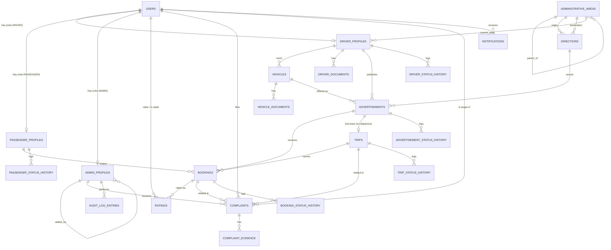

# VTaxi — Database Design (Step 4)

**Status: DRAFT — awaiting approval. No SQL, no SQLAlchemy models in this document, per instruction.**

Role for this document: Principal Database Architect / PostgreSQL Expert / SQLAlchemy 2.0 Expert. Target: 100,000+ users, 10,000+ active advertisements, millions of bookings, and three future consumers (Mobile App, REST API, Web Admin Panel) reading the same schema.

This document supersedes the entity sketches in [`01-SOFTWARE-ARCHITECTURE.md`](01-SOFTWARE-ARCHITECTURE.md) §4 with concrete, production-grade tables. Every table traces back to a bounded context defined there.

---

## 0. Conventions (stated once, apply to every table below unless a table explicitly overrides one)

### 0.1 Primary keys
Every table has `id UUID PRIMARY KEY`. **Recommendation, flagged for your confirmation in §6:** generate these as **UUIDv7** (time-ordered), not UUIDv4 (random). A random UUID as a B-tree primary key causes index page fragmentation on every insert once a table reaches millions of rows (`bookings`, `*_status_history`, `notifications` will get there) — the new row can land anywhere in the index, forcing constant page splits. UUIDv7 keeps the same global-uniqueness/no-coordination benefit as v4 but is monotonically increasing, so inserts append to the right edge of the index like a normal sequence would. Postgres 18 has native `uuidv7()`; our `docker-compose.yml` currently pins Postgres 16, so v7 would need to be generated in the application layer (a ~10-line helper in Step 5) rather than as a column `DEFAULT`. This is a real infrastructure choice, not just a schema detail, hence flagged rather than silently decided.

### 0.2 Timestamps
`created_at TIMESTAMPTZ NOT NULL DEFAULT now()`, `updated_at TIMESTAMPTZ NOT NULL DEFAULT now()` (bumped on every `UPDATE`, enforced by a trigger or the ORM in Step 5 — decided there, not here). `TIMESTAMPTZ` always normalizes to UTC internally regardless of session timezone, which satisfies "UTC timestamps" natively without any application-side conversion.

### 0.3 Soft delete — when it applies and when it deliberately doesn't
`deleted_at TIMESTAMPTZ NULL` is added **only** to tables representing an account/profile/asset that can be *deactivated while still being referenced by history* — you don't want a user's booking history to vanish because they deleted their account. Those tables: `users`, `driver_profiles`, `passenger_profiles`, `admin_profiles`, `vehicles`.

It is **deliberately omitted** from tables that already have an intrinsic terminal status covering "this is over" — `advertisements` (CANCELLED/EXPIRED/CLOSED), `bookings` (REJECTED/CANCELLED), `trips` (CANCELLED). Adding `deleted_at` on top of a status enum would create two competing answers to "is this gone?" — a real normalization/consistency risk, not a simplification. It's also omitted from naturally append-only log tables (`*_status_history`, `audit_log_entries`, `notifications`, `ratings`, `complaint_evidence`) — nothing about "hiding" a log entry makes business sense.

Reference/master data (`administrative_areas`, `directions`) uses `is_active BOOLEAN NOT NULL DEFAULT true` instead of `deleted_at` — deactivating a route or an area is a toggle, not a delete, and this matches the choice already made for `Direction` in docs/01.

### 0.4 Foreign key deletion policy (stated once)
**Hard deletes are not a supported operation for any business-record table.** The only supported "removal" path is `deleted_at` (§0.3) or a terminal status value. Consequently, every FK from a business-record table to another uses **`ON DELETE RESTRICT`** by default — the database physically refuses to let you hard-delete a row something else still points to, which is exactly the guard rail we want. Two explicit exceptions, called out per-table where they occur:
- **`ON DELETE CASCADE`** for pure child/log rows that have zero independent meaning without their parent (`vehicle_documents`, `driver_documents`, `complaint_evidence`, `*_status_history`) and for `notifications.recipient_user_id` (a genuine data-erasure request should be able to remove a user's notification log without being blocked).
- **`ON DELETE SET NULL`** for optional, non-business-critical pointers (`driver_profiles.current_area_id`, `*.reviewed_by_admin_id`, `*.resolved_by_admin_id`) — losing the pointer loses a convenience, not a fact.

### 0.5 Enum storage strategy
All enumerated columns are stored as **`VARCHAR` + a `CHECK (col IN (...))` constraint**, not native PostgreSQL `ENUM` types (`CREATE TYPE ... AS ENUM`). Native enums are cheap to query but expensive to evolve — adding a value is fine, but renaming or removing one requires rebuilding the type, which locks the table. Business vocabularies here (`complaints.reason`, `audit_log_entries.action`, notification channels) are exactly the kind of thing that gains values as the product grows. One consistent strategy across all 20+ enum columns beats deciding table-by-table which storage mechanism to use — simpler for whoever writes the Alembic migrations in Step 6.

### 0.6 Denormalization policy
A few columns below duplicate data derivable from a join (e.g., `advertisements.vehicle_class` mirrors `vehicles.vehicle_class`; `bookings.accepted_at` mirrors a row in `booking_status_history`). Each is called out explicitly with its specific read-path justification — this is not an oversight, it's a deliberate, narrow set of hot-path optimizations, kept to a minimum on purpose.

---

## 1. Entity list, grouped by bounded context

| Group (docs/01 context) | Tables |
|---|---|
| Identity & Access | `users`, `driver_profiles`, `passenger_profiles`, `admin_profiles` |
| Geography | `administrative_areas`, `directions` |
| Driver Verification (vehicle side) | `vehicles`, `vehicle_documents`, `driver_documents` |
| Advertisement / Booking / Trip Execution | `advertisements`, `bookings`, `trips` |
| Rating & Feedback | `ratings` |
| Complaint | `complaints`, `complaint_evidence` |
| Notification | `notifications` |
| Admin Audit Log | `audit_log_entries` |
| Lifecycle history (cross-cutting pattern) | `driver_status_history`, `passenger_status_history`, `advertisement_status_history`, `trip_status_history`, `booking_status_history` |

**22 tables.** Contexts with no dedicated table in this step, and why: **Queue Engine** (state is ephemeral, high-churn — lives in Redis per docs/01 §14.5, not Postgres); **Statistics** (read-only queries/materialized views over the tables above, per docs/01 §14.10 — no independent data to own); **Search Engine** (a query pattern over `administrative_areas`, not a new table — see its indexing note in §2.2); **Payment** (explicitly seam-only per docs/01 §14.11 and this step's instructions — no `payments` table until a payments step is scheduled).

---

## 2. Table specifications

### 2.1 Identity & Access

#### `users`
**Purpose:** the single identity record for every platform participant, regardless of role. Role-specific data lives in the three extension tables below (class-table-inheritance pattern) instead of one wide table, so a passenger's row never carries empty driver-only columns and vice versa.

| Column | Type | Null | Notes |
|---|---|---|---|
| id | UUID | NO | PK |
| telegram_id | BIGINT | NO | Telegram's user id |
| phone_number | VARCHAR(20) | NO | E.164 normalized |
| full_name | VARCHAR(150) | NO | |
| role | VARCHAR(10) | NO | `PASSENGER` \| `DRIVER` \| `ADMIN` |
| is_active | BOOLEAN | NO | default `true`; admin-level kill switch independent of `deleted_at` |
| created_at / updated_at / deleted_at | — | — | see §0.2/§0.3 |

- **PK:** `id`
- **FK:** none outward
- **Indexes:** `UNIQUE (telegram_id)`; `UNIQUE (phone_number) WHERE deleted_at IS NULL` (partial unique — a phone number can be reused once its old account is soft-deleted); `INDEX (role)`
- **Constraints:** `CHECK (role IN ('PASSENGER','DRIVER','ADMIN'))`
- **Relationships:** 1:1 with at most one of `driver_profiles` / `passenger_profiles` / `admin_profiles`, chosen by `role`
- **Why a single `users` table at all, instead of three fully independent tables:** phone verification, suspension, and Telegram identity are identical concerns across all three roles — duplicating them three times would violate DRY for zero benefit, since nothing about verifying a phone number differs by role.

#### `driver_profiles`
**Purpose:** everything specific to being a driver: verification gate, operational availability, last known location. Kept off `users` because it's a different bounded context (docs/01 §3.1) with its own lifecycle.

| Column | Type | Null | Notes |
|---|---|---|---|
| id | UUID | NO | PK |
| user_id | UUID | NO | FK → `users(id)` |
| approval_status | VARCHAR(20) | NO | `PENDING_REVIEW` \| `APPROVED` \| `REJECTED` — the one-time verification gate (docs/01 §14.3) |
| availability_status | VARCHAR(10) | NO | `ONLINE` \| `OFFLINE` \| `BUSY` \| `ON_TRIP` \| `BANNED` — operational visibility (docs/01 §14.3) |
| current_latitude | DOUBLE PRECISION | YES | last check-in location |
| current_longitude | DOUBLE PRECISION | YES | |
| current_area_id | UUID | YES | FK → `administrative_areas(id)`, `ON DELETE SET NULL` |
| location_updated_at | TIMESTAMPTZ | YES | |
| approved_at | TIMESTAMPTZ | YES | |
| approved_by_admin_id | UUID | YES | FK → `admin_profiles(id)`, `ON DELETE SET NULL` |
| created_at / updated_at / deleted_at | — | — | |

- **PK:** `id`
- **FK:** `user_id → users(id) ON DELETE CASCADE` (pure 1:1 extension — a hard-deleted user takes their extension row with it); `current_area_id → administrative_areas(id) ON DELETE SET NULL`; `approved_by_admin_id → admin_profiles(id) ON DELETE SET NULL`
- **Indexes:** `UNIQUE (user_id)`; `INDEX (approval_status)`; `INDEX (availability_status)`; composite `INDEX (availability_status, current_area_id)` — the exact shape of Matching's "find ONLINE drivers near this area" query
- **Constraints:** `CHECK (approval_status IN (...))`; `CHECK (availability_status IN (...))`
- **Relationships:** 1:1 `users`; 1:N `vehicles`, `driver_documents`, `advertisements`, `trips`
- **Why `current_latitude/longitude` here is not redundant with `advertisements.pickup_latitude/longitude`:** this column is "where the driver's device last checked in" (operational — drives ONLINE/OFFLINE discoverability and Queue Engine bucketing, updated independently of any listing). The advertisement's pickup point is "the declared pickup point for this specific listing" (a business fact the passenger booked against) — it doesn't silently change just because the driver's phone moved. Two different questions, two different columns.

#### `passenger_profiles`
**Purpose:** passenger-specific state — currently just the status projection from docs/01 §14.4, kept off `users` for the same reason as `driver_profiles`.

| Column | Type | Null | Notes |
|---|---|---|---|
| id | UUID | NO | PK |
| user_id | UUID | NO | FK → `users(id)` |
| passenger_status | VARCHAR(10) | NO | `ACTIVE` \| `WAITING` \| `BOOKED` \| `ON_TRIP` \| `COMPLETED` \| `BANNED` |
| created_at / updated_at / deleted_at | — | — | |

- **PK:** `id`
- **FK:** `user_id → users(id) ON DELETE CASCADE`
- **Indexes:** `UNIQUE (user_id)`; `INDEX (passenger_status)`
- **Constraints:** `CHECK (passenger_status IN (...))`
- **Relationships:** 1:1 `users`; 1:N `bookings`
- **Why this projection is a stored column, not computed on read:** it's written exclusively by domain-event handlers (docs/01 §14.4), never by a use case directly — storing it lets a single indexed query answer "how many passengers are currently WAITING" for Statistics, without recomputing from `bookings` on every read.

#### `admin_profiles`
**Purpose:** marks a `user` as platform staff and records who granted that access, for accountability. Kept intentionally minimal — see §6 for the permission-tiering question I did **not** resolve unilaterally.

| Column | Type | Null | Notes |
|---|---|---|---|
| id | UUID | NO | PK |
| user_id | UUID | NO | FK → `users(id)` |
| added_by_admin_id | UUID | YES | self-FK — who granted admin rights |
| created_at / updated_at / deleted_at | — | — | |

- **PK:** `id`
- **FK:** `user_id → users(id) ON DELETE CASCADE`; `added_by_admin_id → admin_profiles(id) ON DELETE SET NULL`
- **Indexes:** `UNIQUE (user_id)`
- **Relationships:** 1:1 `users`; referenced by `audit_log_entries`, `*.approved_by_admin_id`, `*.resolved_by_admin_id`
- **Why not add a `permission_level` column:** nothing in the brief asked for tiered admin permissions, and adding one now would be a guess at a policy nobody has specified — YAGNI. `added_by_admin_id` is the one field cheap enough, and important enough for audit completeness, to include without being asked explicitly. Flagged as an open question in §6 rather than assumed either way.

### 2.2 Geography

#### `administrative_areas`
**Purpose:** a single self-referential tree covering Country → Region → District → City → Village → Mahalla (and, since the tree is generic, any future level such as Street needs zero schema change — just a new `level` value and data rows). This directly satisfies "do not hardcode Namangan/Tashkent" — a third city, or a second country, is a data insert, never a migration.

**Why one generic tree instead of six rigid tables (`countries`, `regions`, `districts`, ...):** real administrative hierarchies are irregular — Tashkent city sits differently in the tree than a typical viloyat/region, and a future country might not nest the same way at all. Six FK-chained tables would break the first time a path doesn't fit the assumed depth; a self-referential adjacency list handles arbitrary depth and irregular shapes by construction.

| Column | Type | Null | Notes |
|---|---|---|---|
| id | UUID | NO | PK |
| parent_id | UUID | YES | self-FK; NULL only for the root `COUNTRY` row(s) |
| level | VARCHAR(10) | NO | `COUNTRY` \| `REGION` \| `DISTRICT` \| `CITY` \| `VILLAGE` \| `MAHALLA` |
| name | VARCHAR(150) | NO | |
| centroid_latitude | DOUBLE PRECISION | YES | approximate center, for distance estimates when a user picks by hierarchy instead of a live pin |
| centroid_longitude | DOUBLE PRECISION | YES | |
| is_active | BOOLEAN | NO | default `true` (see §0.3) |
| created_at / updated_at | — | — | |

- **PK:** `id`
- **FK:** `parent_id → administrative_areas(id) ON DELETE RESTRICT` (a place can't be deleted while it still has children — deactivate the subtree via `is_active` instead)
- **Indexes:** `INDEX (parent_id)`; `INDEX (level)`; composite `INDEX (level, parent_id)`; **`GIN` trigram index (`pg_trgm`) on `name`** — this is what the Search Engine context (docs/01 §14.9) runs address autocomplete against, so it belongs here rather than as a separate table
- **Constraints:** `CHECK (level IN (...))`
- **Relationships:** self-referential 1:N; referenced by `directions`, `advertisements.pickup_area_id`/`destination_area_id`, `driver_profiles.current_area_id`
- **Why `centroid_latitude/longitude` is nullable and approximate, not a hard requirement:** it's a fallback for distance math when someone used the hierarchical selector instead of a live pin — precision isn't the point, having *something* to compute a rough distance from is.

#### `directions`
**Purpose:** the explicit whitelist of city-pairs the platform currently serves (docs/01 §10). Without this table, "is Namangan⇄Tashkent a supported route" would require walking the area tree at query time on every search; with it, it's a single indexed lookup, and an admin can toggle a corridor on/off without touching geography data.

| Column | Type | Null | Notes |
|---|---|---|---|
| id | UUID | NO | PK |
| origin_area_id | UUID | NO | FK → `administrative_areas(id)` |
| destination_area_id | UUID | NO | FK → `administrative_areas(id)` |
| is_active | BOOLEAN | NO | default `true` |
| created_at / updated_at | — | — | |

- **PK:** `id`
- **FK:** `origin_area_id → administrative_areas(id) ON DELETE RESTRICT`; `destination_area_id → administrative_areas(id) ON DELETE RESTRICT`
- **Indexes:** `UNIQUE (origin_area_id, destination_area_id)`; `INDEX (is_active)`
- **Relationships:** referenced by `advertisements.direction_id`
- **Why directionality is two rows, not one symmetric row:** Namangan→Tashkent and Tashkent→Namangan are different searches with (likely) different demand patterns; modeling them as two rows means Matching never needs an `OR`-based symmetric lookup.

### 2.3 Vehicle & Documents

#### `vehicles`
**Purpose:** a driver can register more than one vehicle over time (e.g., an Economy car and a Minivan); each `advertisement` pins down exactly which one is being offered.

| Column | Type | Null | Notes |
|---|---|---|---|
| id | UUID | NO | PK |
| driver_id | UUID | NO | FK → `driver_profiles(id)` |
| brand | VARCHAR(50) | NO | |
| model | VARCHAR(50) | NO | |
| color | VARCHAR(30) | NO | |
| plate_number | VARCHAR(20) | NO | |
| vehicle_class | VARCHAR(10) | NO | `ECONOMY` \| `COMFORT` \| `BUSINESS` \| `MINIVAN` |
| seat_count | SMALLINT | NO | |
| verification_status | VARCHAR(20) | NO | `PENDING_REVIEW` \| `APPROVED` \| `REJECTED` |
| created_at / updated_at / deleted_at | — | — | |

- **PK:** `id`
- **FK:** `driver_id → driver_profiles(id) ON DELETE RESTRICT`
- **Indexes:** `INDEX (driver_id)`; `INDEX (vehicle_class)`; `UNIQUE (plate_number) WHERE deleted_at IS NULL`
- **Constraints:** `CHECK (seat_count > 0)`; `CHECK (vehicle_class IN (...))`; `CHECK (verification_status IN (...))`
- **Relationships:** N:1 `driver_profiles`; 1:N `vehicle_documents`; referenced by `advertisements.vehicle_id`

#### `vehicle_documents`
**Purpose:** registration, insurance, technical inspection, and photos, each as its own row rather than four nullable columns on `vehicles` — a driver re-uploading an expired insurance document creates a new row and keeps the old one for audit history, instead of overwriting evidence.

| Column | Type | Null | Notes |
|---|---|---|---|
| id | UUID | NO | PK |
| vehicle_id | UUID | NO | FK → `vehicles(id)` |
| document_type | VARCHAR(25) | NO | `REGISTRATION` \| `INSURANCE` \| `TECHNICAL_INSPECTION` \| `PHOTO` |
| file_reference | VARCHAR(255) | NO | Telegram `file_id` (docs/01 ADR-010) |
| verification_status | VARCHAR(20) | NO | `PENDING_REVIEW` \| `APPROVED` \| `REJECTED` |
| reviewed_by_admin_id | UUID | YES | FK → `admin_profiles(id)` |
| reviewed_at | TIMESTAMPTZ | YES | |
| created_at / updated_at | — | — | *(no `deleted_at`: documents are immutable historical records, superseded by a new row, never deleted)* |

- **PK:** `id`
- **FK:** `vehicle_id → vehicles(id) ON DELETE CASCADE`; `reviewed_by_admin_id → admin_profiles(id) ON DELETE SET NULL`
- **Indexes:** `INDEX (vehicle_id)`; `INDEX (document_type)`; `INDEX (verification_status)`
- **Relationships:** N:1 `vehicles`

#### `driver_documents`
**Purpose:** license and profile photo, same shape as `vehicle_documents`, attached to the driver instead of the vehicle.

| Column | Type | Null | Notes |
|---|---|---|---|
| id | UUID | NO | PK |
| driver_id | UUID | NO | FK → `driver_profiles(id)` |
| document_type | VARCHAR(20) | NO | `LICENSE` \| `PROFILE_PHOTO` |
| file_reference | VARCHAR(255) | NO | |
| verification_status | VARCHAR(20) | NO | |
| reviewed_by_admin_id | UUID | YES | FK → `admin_profiles(id)` |
| reviewed_at | TIMESTAMPTZ | YES | |
| created_at / updated_at | — | — | |

- **PK / FK / Indexes / Constraints:** identical pattern to `vehicle_documents`, FK target `driver_id → driver_profiles(id) ON DELETE CASCADE`
- **Why two separate tables instead of one polymorphic `documents` table with an `owner_type`/`owner_id` pair:** a polymorphic association can't be enforced by a real foreign key in Postgres — you'd lose referential integrity exactly where it matters most (verified legal documents). Two small, explicitly-FK'd tables cost one extra table definition and buy back a guarantee worth having.

### 2.4 Advertisement → Booking → Trip (the core transactional flow)

#### `advertisements`
**Purpose:** what a driver publishes (docs/01 §14.1). The seat-accounting columns here are the crux of correctness under concurrency — see the worked example after the table.

| Column | Type | Null | Notes |
|---|---|---|---|
| id | UUID | NO | PK |
| driver_id | UUID | NO | FK → `driver_profiles(id)` |
| vehicle_id | UUID | NO | FK → `vehicles(id)` |
| vehicle_class | VARCHAR(10) | NO | **denormalized** snapshot of `vehicles.vehicle_class` |
| direction_id | UUID | NO | FK → `directions(id)` |
| pickup_area_id | UUID | NO | FK → `administrative_areas(id)` |
| destination_area_id | UUID | NO | FK → `administrative_areas(id)` |
| pickup_latitude | DOUBLE PRECISION | NO | precise pickup pin, one-shot (docs/01 §14.2) |
| pickup_longitude | DOUBLE PRECISION | NO | |
| destination_latitude | DOUBLE PRECISION | YES | optional — destination is often just an area, not a pin |
| destination_longitude | DOUBLE PRECISION | YES | |
| departure_time | TIMESTAMPTZ | NO | |
| price | NUMERIC(12,2) | NO | |
| total_seats | SMALLINT | NO | |
| available_seats | SMALLINT | NO | freely bookable right now |
| reserved_seats | SMALLINT | NO | default `0`; held by `PENDING` bookings |
| status | VARCHAR(10) | NO | `DRAFT` \| `ACTIVE` \| `FULL` \| `CLOSED` \| `CANCELLED` \| `EXPIRED` |
| expires_at | TIMESTAMPTZ | YES | sweep target for the background worker (docs/01 ADR-009) |
| created_at / updated_at / deleted_at | — | — | |

- **PK:** `id`
- **FK:** `driver_id → driver_profiles(id) ON DELETE RESTRICT`; `vehicle_id → vehicles(id) ON DELETE RESTRICT`; `direction_id → directions(id) ON DELETE RESTRICT`; `pickup_area_id`/`destination_area_id → administrative_areas(id) ON DELETE RESTRICT`
- **Indexes:** composite `INDEX (direction_id, status, departure_time)` — **this is the single most important index in the schema**, the exact shape of the Matching hot-path query ("active ads on this direction, soonest first"); `INDEX (driver_id)`; partial `INDEX (expires_at) WHERE status IN ('ACTIVE','FULL')` for the expiry sweep
- **Constraints:** `CHECK (status IN (...))`; `CHECK (total_seats > 0)`; `CHECK (available_seats >= 0)`; `CHECK (reserved_seats >= 0)`; `CHECK (available_seats + reserved_seats <= total_seats)`
- **Relationships:** N:1 `driver_profiles`, `vehicles`, `directions`, `administrative_areas` (×2); 1:N `bookings`; 1:1 `trips`
- **Why `available_seats` *and* `reserved_seats` are both stored, rather than deriving one from bookings on the fly:** they encode a two-phase reservation. A `PENDING` booking moves seats from `available` into `reserved` (a soft hold) so two simultaneous requests for the last seat can't both succeed; the driver's decision then either returns the seats to `available` (reject/cancel) or lets them fall out of both buckets entirely (accept — the seat is now permanently consumed, tracked implicitly as `total_seats − available_seats − reserved_seats`). Concretely, with 4 total seats:

  ```
  total=4 available=4 reserved=0                       -- ad published
  passenger A requests 2  -> available=2 reserved=2      -- soft hold
  driver accepts A        -> available=2 reserved=0      -- 2 seats now permanently gone
  passenger B requests 1  -> available=1 reserved=1
  passenger C requests 1  -> available=0 reserved=1      -- FULL as soon as this commits
  driver accepts B        -> available=0 reserved=0? no: reserved was shared -- see note
  ```
  (the worked concurrency mechanics — one atomic `UPDATE ... WHERE available_seats >= :n` statement per request, extended from docs/01 §6 to touch both columns in the same statement — are finalized in Step 5 when the actual SQL/ORM code is written; this table only needs to guarantee the invariant `available_seats + reserved_seats <= total_seats` holds at all times, which the `CHECK` constraint above enforces as a last line of defense even if application logic has a bug.)
- **Why `vehicle_class` is duplicated from `vehicles`:** Matching filters by vehicle class extremely often (a passenger wants Comfort, not Economy); joining to `vehicles` on every matching query for a column that essentially never changes mid-advertisement isn't worth the join. If a driver's vehicle class is later corrected, historical advertisements correctly keep showing what a passenger actually booked.

#### `bookings`
**Purpose:** one passenger's claim against an advertisement (docs/01 §6).

| Column | Type | Null | Notes |
|---|---|---|---|
| id | UUID | NO | PK |
| advertisement_id | UUID | NO | FK → `advertisements(id)` |
| passenger_id | UUID | NO | FK → `passenger_profiles(id)` |
| trip_id | UUID | YES | FK → `trips(id)`, populated once the advertisement departs |
| requested_seats | SMALLINT | NO | |
| status | VARCHAR(10) | NO | `PENDING` \| `ACCEPTED` \| `REJECTED` \| `CANCELLED` \| `COMPLETED` |
| passenger_comment | TEXT | YES | |
| driver_comment | TEXT | YES | |
| accepted_at | TIMESTAMPTZ | YES | **denormalized**, see below |
| cancelled_at | TIMESTAMPTZ | YES | |
| completed_at | TIMESTAMPTZ | YES | |
| created_at / updated_at | — | — | |

- **PK:** `id`
- **FK:** `advertisement_id → advertisements(id) ON DELETE RESTRICT`; `passenger_id → passenger_profiles(id) ON DELETE RESTRICT`; `trip_id → trips(id) ON DELETE RESTRICT`
- **Indexes:** `INDEX (advertisement_id, status)` (how many pending/accepted requests does this ad have); `INDEX (passenger_id)`; `INDEX (trip_id)`
- **Constraints:** `CHECK (requested_seats > 0)`; `CHECK (status IN (...))`
- **Relationships:** N:1 `advertisements`, `passenger_profiles`, `trips` (nullable); referenced by `ratings.booking_id`
- **Why there's no separate "Driver Decision" column:** the brief listed it alongside `status`, but a driver's decision *is* the transition of `status` to `ACCEPTED` or `REJECTED` — a second column recording the same fact would just be a second source of truth for one decision. Simplification made deliberately, flagged in §6.
- **Why `accepted_at`/`cancelled_at`/`completed_at` duplicate what `booking_status_history` already records:** those three timestamps are read on essentially every "my bookings" list view; `booking_status_history` exists for the full audit trail (every transition, who/why), not for the hot read path. Denormalizing the three that matter for the common view avoids a join/subquery there.

#### `trips`
**Purpose:** the realized journey (docs/01 §14.1) — created once, when the driver departs with whichever bookings were accepted by then.

| Column | Type | Null | Notes |
|---|---|---|---|
| id | UUID | NO | PK |
| advertisement_id | UUID | NO | FK → `advertisements(id)`, unique (1:1) |
| driver_id | UUID | NO | FK → `driver_profiles(id)`, **denormalized** from the advertisement |
| start_time | TIMESTAMPTZ | NO | |
| end_time | TIMESTAMPTZ | YES | |
| status | VARCHAR(10) | NO | `STARTED` \| `COMPLETED` \| `CANCELLED` |
| created_at / updated_at | — | — | |

- **PK:** `id`
- **FK:** `advertisement_id → advertisements(id) ON DELETE RESTRICT`; `driver_id → driver_profiles(id) ON DELETE RESTRICT`
- **Indexes:** `UNIQUE (advertisement_id)`; `INDEX (driver_id)`; `INDEX (status)`; `INDEX (start_time)`
- **Relationships:** 1:1 `advertisements`; N:1 `driver_profiles`; 1:N `bookings` (via `bookings.trip_id`)
- **Why "Passengers" isn't a `trip_passengers` join table:** `bookings` already records exactly "this passenger, this seat count, this ad." Once a trip starts, the accepted bookings for that advertisement simply get their `trip_id` set — adding a whole second join table to say the same thing again would be duplicated modeling for no new information.
- **Why `driver_id` is duplicated from `advertisements.driver_id`:** "all trips completed by driver X" (a Statistics/driver-dashboard query, docs/01 §14.10) is common enough to want a direct index instead of joining through `advertisements` every time.

### 2.5 Rating, Complaint, Notification, Audit

#### `ratings`
**Purpose:** mutual post-trip feedback (docs/01 §3).

| Column | Type | Null | Notes |
|---|---|---|---|
| id | UUID | NO | PK |
| booking_id | UUID | NO | FK → `bookings(id)` |
| rater_id | UUID | NO | FK → `users(id)` |
| ratee_id | UUID | NO | FK → `users(id)` |
| rater_role | VARCHAR(10) | NO | `PASSENGER` \| `DRIVER` — who is doing the rating |
| score | SMALLINT | NO | 1–5 |
| comment | TEXT | YES | |
| created_at / updated_at | — | — | |

- **PK:** `id`
- **FK:** `booking_id → bookings(id) ON DELETE RESTRICT`; `rater_id`/`ratee_id → users(id) ON DELETE RESTRICT`
- **Indexes:** `UNIQUE (booking_id, rater_role)` (one rating per direction per booking); `INDEX (ratee_id)` (computing "this driver's average rating"); `INDEX (rater_id)`
- **Constraints:** `CHECK (score BETWEEN 1 AND 5)`; `CHECK (rater_role IN ('PASSENGER','DRIVER'))`
- **Relationships:** N:1 `bookings`, `users` (×2 roles)
- **Why `rater_id`/`ratee_id` are stored directly instead of derived from `booking_id` + `rater_role`:** they could technically be computed (join `bookings` → `passenger_profiles`/`advertisements` → `driver_profiles`), but "all ratings received by user X" is one of the most common profile-page queries on the platform; storing the two user ids directly makes that a single indexed lookup instead of a multi-table join for every profile view.

#### `complaints`
**Purpose:** moderation intake, and per docs/01 §14.6 the *only* path that results in a ban.

| Column | Type | Null | Notes |
|---|---|---|---|
| id | UUID | NO | PK |
| reporter_id | UUID | NO | FK → `users(id)` |
| reporter_role | VARCHAR(10) | NO | `PASSENGER` \| `DRIVER` |
| target_user_id | UUID | YES | FK → `users(id)` — nullable, a complaint can be about the platform in general |
| related_booking_id | UUID | YES | FK → `bookings(id)` |
| related_trip_id | UUID | YES | FK → `trips(id)` |
| reason | VARCHAR(30) | NO | `DRIVER_MISCONDUCT` \| `PASSENGER_MISCONDUCT` \| `VEHICLE_CONDITION` \| `SAFETY_CONCERN` \| `PAYMENT_DISPUTE` \| `NO_SHOW` \| `OTHER` |
| description | TEXT | NO | |
| status | VARCHAR(15) | NO | `OPEN` \| `UNDER_REVIEW` \| `RESOLVED` \| `DISMISSED` |
| resolution_action | VARCHAR(10) | NO | default `NONE`; `NONE` \| `WARNING` \| `BAN` |
| resolved_by_admin_id | UUID | YES | FK → `admin_profiles(id)` |
| resolved_at | TIMESTAMPTZ | YES | |
| created_at / updated_at | — | — | |

- **PK:** `id`
- **FK:** `reporter_id`/`target_user_id → users(id) ON DELETE RESTRICT`; `related_booking_id → bookings(id) ON DELETE SET NULL`; `related_trip_id → trips(id) ON DELETE SET NULL`; `resolved_by_admin_id → admin_profiles(id) ON DELETE SET NULL`
- **Indexes:** `INDEX (target_user_id)`; `INDEX (reporter_id)`; `INDEX (status)`
- **Constraints:** `CHECK (reason IN (...))`; `CHECK (status IN (...))`; `CHECK (resolution_action IN ('NONE','WARNING','BAN'))`
- **Relationships:** N:1 `users` (×2 roles), `bookings`, `trips`, `admin_profiles`; 1:N `complaint_evidence`
- **How `resolution_action` maps to the status fields on `driver_profiles`/`passenger_profiles`:** `WARNING` logs the decision but does **not** change `availability_status`/`passenger_status`; `BAN` is the one action that flips it to `BANNED`. This is also how "User Suspended" from your Step 4 examples is represented — see §6, this needs your confirmation.

#### `complaint_evidence`
**Purpose:** a complaint can carry more than one attachment (screenshots, photos) — one row per file rather than a single column.

| Column | Type | Null | Notes |
|---|---|---|---|
| id | UUID | NO | PK |
| complaint_id | UUID | NO | FK → `complaints(id)` |
| file_reference | VARCHAR(255) | NO | |
| file_type | VARCHAR(10) | NO | `PHOTO` \| `VIDEO` \| `DOCUMENT` |
| created_at | — | — | |

- **PK:** `id`
- **FK:** `complaint_id → complaints(id) ON DELETE CASCADE`
- **Indexes:** `INDEX (complaint_id)`
- **Relationships:** N:1 `complaints`

#### `notifications`
**Purpose:** the outbound message log for the `AbstractNotifier` port (docs/01 §7.5).

| Column | Type | Null | Notes |
|---|---|---|---|
| id | UUID | NO | PK |
| recipient_user_id | UUID | NO | FK → `users(id)` |
| channel | VARCHAR(10) | NO | `TELEGRAM` \| `PUSH` \| `SMS` \| `EMAIL` (only `TELEGRAM` is live; the rest are reserved columns, no active senders yet) |
| message | TEXT | NO | |
| related_entity_type | VARCHAR(30) | YES | e.g. `'booking'`, `'advertisement'` — **not** a real FK, see note |
| related_entity_id | UUID | YES | |
| status | VARCHAR(10) | NO | `PENDING` \| `SENT` \| `FAILED` \| `READ` |
| sent_at | TIMESTAMPTZ | YES | |
| created_at / updated_at | — | — | |

- **PK:** `id`
- **FK:** `recipient_user_id → users(id) ON DELETE CASCADE` (the one deliberate exception to RESTRICT — see §0.4)
- **Indexes:** `INDEX (recipient_user_id)`; `INDEX (status)`; `INDEX (related_entity_type, related_entity_id)`
- **Constraints:** `CHECK (channel IN (...))`; `CHECK (status IN (...))`
- **Relationships:** N:1 `users`
- **Why `related_entity_id` is not a real foreign key:** a notification can be about *any* entity in the system (a booking accepted, a complaint resolved, a broadcast with no related entity at all). Postgres has no native polymorphic FK; enforcing one would mean either a nullable FK column per possible entity type (wasteful, and still not fully enforced) or a full table-per-notification-type design (over-engineered for what is fundamentally a message log, not a system of record). This is a deliberate, narrow exception — the same tradeoff `audit_log_entries.target_entity_id` makes below, for the identical reason.

#### `audit_log_entries`
**Purpose:** append-only record of every **admin** action, written by the audit-logging decorator (docs/01 §14.7) — not a general activity log for ordinary user actions, which is what the five status-history tables below are for.

| Column | Type | Null | Notes |
|---|---|---|---|
| id | UUID | NO | PK |
| admin_id | UUID | NO | FK → `admin_profiles(id)` |
| action | VARCHAR(30) | NO | see enum below |
| target_entity_type | VARCHAR(30) | YES | not a real FK, same reasoning as `notifications` |
| target_entity_id | UUID | YES | |
| reason | TEXT | YES | |
| occurred_at | TIMESTAMPTZ | NO | default `now()` |
| created_at / updated_at | — | — | |

`action` values: `DRIVER_APPROVED`, `DRIVER_REJECTED`, `DRIVER_BANNED`, `PASSENGER_BANNED`, `USER_WARNED`, `ADVERTISEMENT_CLOSED`, `ADVERTISEMENT_CANCELLED`, `TRIP_DELETED`, `BROADCAST_SENT`, `COMPLAINT_RESOLVED`, `COMPLAINT_DISMISSED`.

- **PK:** `id`
- **FK:** `admin_id → admin_profiles(id) ON DELETE RESTRICT`
- **Indexes:** `INDEX (admin_id)`; `INDEX (action)`; `INDEX (target_entity_type, target_entity_id)`; `INDEX (occurred_at)` (time-range queries are the normal access pattern for an audit log)
- **Constraints:** `CHECK (action IN (...))`
- **Relationships:** N:1 `admin_profiles`
- **Two reconciliations with your Step 4 examples, both flagged in §6:**
  1. Your examples included **"Booking Accepted"** and **"Booking Cancelled"** as audit-log entries. Those are *passenger/driver* self-service actions, not admin actions — the audit-logging decorator only wraps admin use cases (that's what makes its completeness guarantee (docs/01 §14.7) meaningful; mixing in ordinary user traffic would both break that guarantee and multiply this table's write volume by orders of magnitude for no compliance benefit). They're fully captured, just in `booking_status_history` instead.
  2. Your examples included **"User Suspended."** I've represented that as `USER_WARNED`, mapped to `complaints.resolution_action = WARNING` (logged, no status change) — distinct from `DRIVER_BANNED`/`PASSENGER_BANNED`, mapped to `resolution_action = BAN` (flips `availability_status`/`passenger_status` to `BANNED`). If you actually intended a third, *persisted* state — a temporary "suspended" status distinct from both "fine" and "permanently banned" — say so now; it changes `driver_profiles.availability_status` and `passenger_profiles.passenger_status`, and Step 5 will lock those enums into ORM code.

### 2.6 Lifecycle status history (one pattern, five tables)

**Shared purpose:** every status-bearing entity (`driver_profiles.availability_status`, `passenger_profiles.passenger_status`, `advertisements.status`, `trips.status`, `bookings.status`) gets an append-only transition log. This is **not** redundant with `audit_log_entries`: the audit log is admin actions specifically (accountability/compliance); these tables log *every* transition regardless of actor, including system-triggered ones (an advertisement auto-flipping to `FULL`, or auto-expiring) — the data Statistics needs to answer "how long do advertisements typically stay active before filling up," which no admin ever touched.

**Shared column shape** (five physical tables, same shape, applied via a single mixin in Step 5 — DRY at the code level, real FK integrity at the schema level, avoiding the polymorphic-association tradeoff discussed above):

| Column | Type | Null | Notes |
|---|---|---|---|
| id | UUID | NO | PK |
| `<owner>_id` | UUID | NO | FK to the owning table, e.g. `advertisement_id → advertisements(id)` |
| from_status | VARCHAR | YES | NULL for the very first row (creation) |
| to_status | VARCHAR | NO | |
| changed_by_user_id | UUID | YES | FK → `users(id)`; **NULL means system-triggered** (auto-expiry, auto-FULL) |
| reason | TEXT | YES | |
| occurred_at | TIMESTAMPTZ | NO | default `now()` |
| created_at / updated_at | — | — | |

- **FK on `<owner>_id`:** `ON DELETE CASCADE` (pure child of its owner; the owner itself is never hard-deleted per §0.4, so this is a correctness formality, not a real-world risk) — `changed_by_user_id → users(id) ON DELETE SET NULL`
- **Indexes:** composite `INDEX (<owner>_id, occurred_at)` on every one of the five — the access pattern is always "history for this one entity, in order"

| Table | Owner FK | Valid `to_status` values |
|---|---|---|
| `driver_status_history` | `driver_id → driver_profiles(id)` | `ONLINE, OFFLINE, BUSY, ON_TRIP, BANNED` |
| `passenger_status_history` | `passenger_id → passenger_profiles(id)` | `ACTIVE, WAITING, BOOKED, ON_TRIP, COMPLETED, BANNED` |
| `advertisement_status_history` | `advertisement_id → advertisements(id)` | `DRAFT, ACTIVE, FULL, CLOSED, CANCELLED, EXPIRED` |
| `trip_status_history` | `trip_id → trips(id)` | `STARTED, COMPLETED, CANCELLED` |
| `booking_status_history` | `booking_id → bookings(id)` | `PENDING, ACCEPTED, REJECTED, CANCELLED, COMPLETED` |

---

## 3. ER Diagram



*(Full column lists are in §2, not repeated in the diagram — this shows entities and relationships only, per standard ER-diagram scope.)*

---

## 4. Review & optimization pass

Per the requested process, here is the second look — concrete changes found and applied, not a restatement of §2:

1. **Rating aggregates were missing.** `driver_profiles` and `passenger_profiles` gain two columns not present in the first draft above:
   - `average_rating NUMERIC(3,2) NULL`
   - `ratings_count INTEGER NOT NULL DEFAULT 0`

   Reasoning: Matching sorts candidates by rating (docs/01 §3), and a driver-facing dashboard shows it constantly. Computing `AVG(score)` over a `ratings` table headed for millions of rows, on every matching query, is exactly the kind of read-path cost that should be paid once (on `INSERT INTO ratings`, via an application-layer update or a trigger — decided in Step 5) rather than on every read. This is the same denormalization policy as §0.6, just caught in this pass rather than the first draft — added directly to the `driver_profiles`/`passenger_profiles` specs in §2.1 rather than listed twice.

2. **Partial index for the expiry sweep**, already folded into `advertisements` in §2.4 (`WHERE status IN ('ACTIVE','FULL')`) rather than an index over the whole table — the sweep job only ever looks at non-terminal rows, and at 10,000+ active advertisements a full-table index would carry a lot of dead weight from `CLOSED`/`CANCELLED`/`EXPIRED` rows it never needs to scan.

3. **The composite `(direction_id, status, departure_time)` index on `advertisements`** is called out explicitly in §2.4 as the most important index in the schema — worth restating here because it's the one index that most directly determines whether the 100k-user NFR (docs/01 §8, "matching query < 200ms p95") is achievable. Everything else in this schema is secondary to that one query being fast.

4. **Geospatial indexing (PostGIS or `earthdistance`/`cube`) is deliberately deferred**, not missing. `pickup_latitude`/`pickup_longitude` are plain `DOUBLE PRECISION` — enough for haversine calculation in application code (docs/01 §14.8, Geo Engine) at current scale, and the column types don't need to change if we later add a `geography(Point,4326)` column and a GiST index once query volume actually demands it. Adding that infrastructure now, before it's needed, would be exactly the over-engineering the brief warns against.

5. **Enum storage strategy (§0.5)** — decided in this pass, applied retroactively to every table above rather than shown as a diff, since it's a single cross-cutting rule, not a per-table change.

6. **UUID version (§0.1)** — flagged, not silently decided, because it has a real infrastructure consequence (app-side generation vs. an extension vs. upgrading Postgres). See §6.

No change was found necessary to the FK deletion policy, the soft-delete rules, or the core Advertisement/Booking/Trip shape from the first draft — those held up under review.

---

## 5. Explicitly out of scope for this schema

- **Queue Engine** state (Redis, not Postgres — docs/01 §14.5)
- **Statistics** dedicated tables (query-time aggregation / materialized views over the tables above, added only if profiling proves it necessary — docs/01 §14.10)
- **Search Engine** dedicated infrastructure (uses the trigram index on `administrative_areas.name`, §2.2 — no separate service until query volume justifies one)
- **`payments`** table and everything under it (seam only — docs/01 §14.11; adding it later is additive, not a migration of existing tables)

---

## 6. Open questions — please confirm before Step 5 locks these into ORM code

1. **UUID v7 vs v4** (§0.1): recommend v7, application-generated (Postgres 16 has no native `uuidv7()`). Confirm, or say "v4 is fine" if the index-fragmentation tradeoff doesn't concern you at current scale.
2. **Admin permission tiers** (§2.1, `admin_profiles`): not added — confirm that a flat admin role (no super-admin/moderator/support distinction) is acceptable for now.
3. **`bookings` — no separate "Driver Decision" column** (§2.4): confirmed as redundant with `status`, unless you had something else in mind by that field.
4. **"User Suspended" reconciliation** (§2.5, `audit_log_entries`): mapped to `USER_WARNED` (no status change) as distinct from `DRIVER_BANNED`/`PASSENGER_BANNED` (status change). If you want a real third persisted state — temporary suspension distinct from permanent ban — this is the last easy point to add it; it becomes much more invasive once Step 5's models and Step 6's migrations exist.
5. **Carried over from Step 2, still open:** whether `FULL → ACTIVE` should auto-reverse when a `PENDING`/`ACCEPTED` booking is cancelled and seats free up (docs/01 §13, item 1). This schema supports either answer without changes — it's purely an application-layer rule in Step 8 — but flagging again since it hasn't been explicitly confirmed yet.

---

## Next Step

**Step 5 — SQLAlchemy 2.0 Models**, implementing exactly the 22 tables above (plus the shared `StatusHistoryMixin` noted in §2.6) — no new tables, no schema changes, unless the open questions above change something first.

**Waiting for approval before Step 5.**
